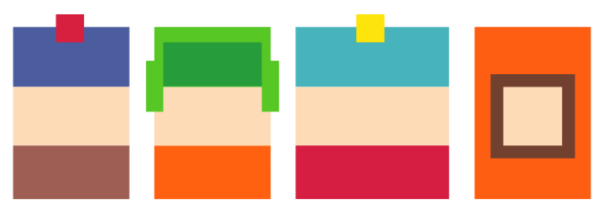

  

# 🐦 South Chirper

> Uma rede social inspirada em South Park — caótica, divertida e cheia de personalidade.

---

## 🌍 Visão Geral do Projeto

O **South Chirper** é uma plataforma social onde usuários podem postar mensagens ("Chirps"), curtir, comentar e interagir em um ambiente estilizado com a estética de *South Park*.

O sistema foi desenvolvido com foco em:
- Interatividade em tempo real
- Experiência divertida e imersiva
- Interface estilizada com Tailwind CSS
- Armazenamento de mídia em nuvem (Cloudinary)

---

## ⚙️ Funcionalidades Principais

- 📝 Criar posts (Chirps)
- ❤️ Curtir posts
- 💬 Comentar em posts
- 🔔 Sistema de notificações
- 👤 Edição de perfil com upload de foto
- ☁️ Upload de imagens via Cloudinary
- 🎵 Sistema de áudio interativo
- ❄️ Efeitos visuais (neve animada)
- 🚫 Exclusão de conta com confirmação estilizada
- 🔗 Redirecionamento por notificações direto ao post

---

## 📁 Estrutura do Projeto
📦 South-Chirper/
┣ 📂 app/ → Controllers e Models (Laravel)
┣ 📂 resources/views/ → Blade Templates
┣ 📂 public/
┃ ┣ 📂 images/ → Imagens do sistema
┃ ┣ 📂 audio/ → Áudios e efeitos sonoros
┃ ┗ 📂 storage/ → (link simbólico para uploads locais)
┣ 📂 routes/ → Rotas web.php
┣ 📂 database/ → migrations e sqlite
┣ 📄 .env → Variáveis de ambiente
┣ 📄 README.md → Documentação

---

## ▶️ Como Executar o Projeto

### 🔌 1. Clonar o repositório

git clone https://github.com/SEU-USUARIO/south-chirper.git
cd south-chirper
composer install
npm install
php artisan serve
http://127.0.0.1:8000

---

## 🚀 Deploy

O projeto pode ser hospedado em:

- Laravel Cloud  
- Vercel (frontend estático)  
- Render / Railway  

⚠️ **IMPORTANTE:**

- Configure corretamente o `.env` no deploy  
- Use Cloudinary para evitar problemas com storage  

---

## 🛠️ Stack de Tecnologias

### 🧠 Backend

- Laravel 12  
- PHP 8.4  
- SQLite (dev)  

---

### 🎨 Frontend

- Blade Templates  
- Tailwind CSS  
- JavaScript puro  

---

### ☁️ Cloud

- Armazenamento de imagens  
- CDN de mídia  

---

## 🔊 Recursos Especiais

- 🎵 Sons interativos ao clicar  
- ❄️ Neve animada dinâmica  
- 😂 Humor estilo South Park  
- 🎯 Interface altamente personalizada  

---

## 👩‍💻 Desenvolvedora

<table>
  <tr>
    <td align="center">
      <a href="https://github.com/sofismoura">
         
        <b>Sofia Moura</b> 
      </a>
    </td>
  </tr>
</table>

---

## 🏫 Projeto Acadêmico

Desenvolvido como projeto prático aplicando:

- Desenvolvimento Web  
- UX/UI  
- Integração com APIs  
- Deploy em nuvem  

---

## ⭐ Apoie o Projeto

Se você curtiu esse caos organizado:

- ⭐ Dá uma estrela no repositório  
- 💬 Sugestões são bem-vindas  
- 🔥 E não esquece: **RESPEITE MINHA AUTORIDADE!**  

---

  

